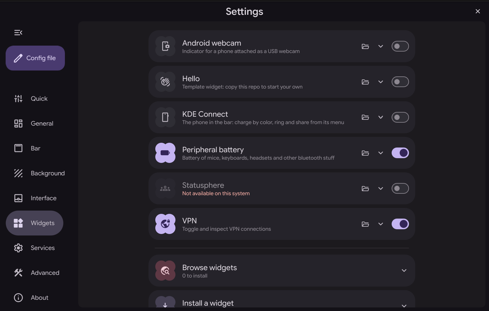
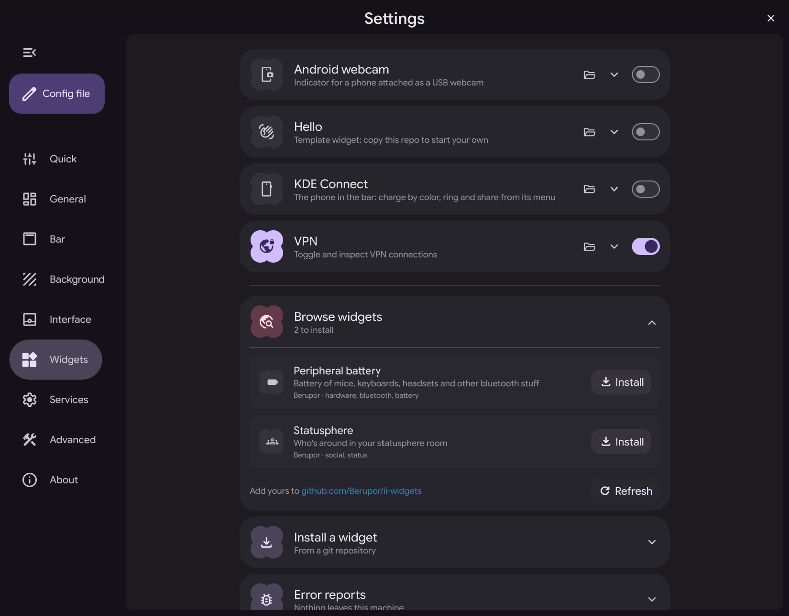

A personal fork of [end-4/dots-hyprland](https://github.com/end-4/dots-hyprland)
(*illogical-impulse*, Quickshell config `ii`). Everything upstream still applies:
same installer, same keybinds, same [wiki](https://ii.clsty.link/en/ii-qs/01setup/).
For upstream's own feature list and screenshots, see
[its README](https://github.com/end-4/dots-hyprland/blob/main/.github/README.md).

The fork adds one thing: an extension system. A widget is a folder with a manifest,
shipped here or cloned from a url; the shell finds it on its own, the settings app
lists it, and adding one edits no shared file.

## Status

I run it daily, and so does a friend of mine. That is the whole user base for now.
What works today:

- a catalog with a settings page: widgets are picked per machine, and a widget
  whose dependency is missing says so on its card;
- installing a widget from a git url and updating it from the same page. Every
  widget I have written lives in its own repository;
- a [registry](https://github.com/Berupor/ii-widgets) to install from by name, so a
  widget is found instead of pasted;
- versions on both sides, so a widget built against a shell it does not know stays
  off;
- probes, assertion cases and a design lint that render a widget in a throwaway
  shell instance, on a pre-push hook. The running session is never touched.

The open question is what an upstream merge costs. The fork touches 18 upstream
files, +172/-27 in total: nine carry the catalog hooks, a handful of lines each,
and the rest are bug fixes that belong in a PR upstream. The catalog itself lives
in files of its own. No upstream release has landed since it branched, so there is
nothing to show yet. If merges stay cheap through a few of them, the next step is
an RFC for [#3073](https://github.com/end-4/dots-hyprland/issues/3073).

## Branches

| Branch | What it is |
| --- | --- |
| `extensions` | Default. Upstream plus the widget catalog. |
| `main` | Untouched mirror of `end-4/main`, kept only to merge from. |

## Widgets

All widgets ship disabled. The settings app has a Widgets page that lists them with
their options; picks are saved to `~/.config/illogical-impulse/widgets.json`, which
nothing else touches. The same page carries one switch for error reports, off by
default: turn it on and a widget failure is sent to my [Bugsink](https://www.bugsink.com/)
at `reports.ug3n.com`, with the last 100 log lines, window titles and paths
included. Off, nothing leaves the machine and failures only land in the shell log.
Set `errorReportsTarget` in the same json to post them to a receiver of your own.



The folder icon marks a widget installed from a url. A greyed out card carries the
reason: a missing binary, or a shell version it was not built for.

Nothing ships with the shell itself. Browse widgets on that page lists what
[the registry](https://github.com/Berupor/ii-widgets) knows and installs it in a click;
a repository not in the registry still goes in by url.



Every widget below has its own pictures and options:

- [Peripheral battery](https://github.com/Berupor/ii-widget-peripheral-battery):
  mice, keyboards, headsets and other bluetooth things, in the bar and a
  right-sidebar tab.
- [Android webcam](https://github.com/Berupor/ii-widget-android-webcam): a phone
  plugged in as a USB webcam, and the adb call that puts it in that mode.
- [KDE Connect](https://github.com/Berupor/ii-widget-kdeconnect): the phone's charge
  by the color of a bar button, and ring, clipboard and files from its menu.
- [Statusphere](https://github.com/Berupor/ii-widget-statusphere): a room of
  friends on the desktop, client for
  [statusphere](https://github.com/MAX1T1A/statusphere).
- [VPN](https://github.com/Berupor/ii-widget-vpn): NetworkManager profiles and
  tailscale exit nodes, from a button in the bar.
- [Hello](https://github.com/Berupor/ii-widget-hello): the template to copy when
  writing your own.

## Not widgets, just patches

- Even spacing around the bar media and clock modules.
- Bar CPU load leaves out I/O wait, which is not busy time.
- Lock screen fingerprint re-arms after an unrecognized read.
- Wallpaper thumbnails go through a temp file and a retry, so two views sharing one
  no longer race for it.
- Tray conflict check asks who owns the watcher name instead of whether kded6 runs.
- Settings: nav rail highlights the tab you picked, labels do not fly in on open,
  and selection tooltips render.

## Install

```sh
git clone --recurse-submodules -b extensions https://github.com/Berupor/dots-hyprland-extensions.git
cd dots-hyprland-extensions
```

Cloned without submodules? `git submodule update --init --recursive`. The shell needs
`modules/common/widgets/shapes`; empty, every `MaterialShape` user fails to load.

From scratch, upstream's installer takes it from here (packages, services, every
config - it's a long one):

```sh
./setup install
```

Already running *illogical-impulse*? Only the shell config differs, so keep the old
one around and swap the tree:

```sh
cp -a ~/.config/quickshell/ii ~/.config/quickshell/ii.upstream
rsync -a --delete dots/.config/quickshell/ii/ ~/.config/quickshell/ii/
```

`Ctrl+Super+R` restarts the shell, then pick widgets in the settings app. `--delete`
leaves exactly the fork's tree behind, local edits under `ii/` included - hence the
copy. Nothing outside `ii/` changes and no extra packages are needed: widgets ship
disabled and nothing new is on by default.

`./setup install-files` sits in between: all the config files, no packages. Take that
one instead of the rsync if your dots are older than this branch's merge base, since
the shell alone would end up newer than everything around it. Compare the two dates:

```sh
git -C /path/to/your/dots-hyprland log -1 --date=short --format='%ad %s'
git log -1 --date=short --format='%ad %s' origin/main   # the upstream mirror, see Branches
```

Clashing files go to `~/ii-original-dots-backup`.

## The way back

```sh
rm -rf ~/.config/quickshell/ii
mv ~/.config/quickshell/ii.upstream ~/.config/quickshell/ii
```

Kept no copy? The same clone carries the untouched upstream shell:

```sh
git checkout main
rsync -a --delete dots/.config/quickshell/ii/ ~/.config/quickshell/ii/
```

Either way, `rm ~/.config/illogical-impulse/widgets.json` forgets the widget picks.
Your `config.json` survives both directions - upstream skips the keys it doesn't know.

## Writing a widget

One folder with a `Manifest.qml`, living in its own repository and installed as
`~/.config/illogical-impulse/widgets/<id>/`. It declares its slots, its options and
the binaries it needs, and the settings page draws the options for you. The contract
is written down in `modules/widgets/WidgetManifest.qml`;
[ii-widget-hello](https://github.com/Berupor/ii-widget-hello) is the smallest widget
that covers all of it, made to be copied. The same folder also works inside the shell
tree, as `dots/.config/quickshell/ii/modules/widgets/<id>/`. A bar slot lists the
orientations it draws for, so a widget can take the vertical bar, the horizontal one,
or both.

Colors and fonts come from `Appearance.*`, generated from the wallpaper, so a widget
that hardcodes them looks wrong on everyone else's desktop and the lint says so. The
fork's own toolkit works on a widget outside it too:

```sh
tests/widget-probe.sh <widget> <slot> [-x /path/to/your/widget]   # render it, alone
tests/qml-cases.sh    -x /path/to/your/widget                     # its demo scenes as tests
tests/widget-shots.sh -x /path/to/your/widget                     # README pictures
tests/design-lint.sh  /path/to/your/widget                        # the color contract
```

## Pulling upstream

```sh
git fetch upstream
git merge upstream/main
```

Merge, not rebase: pushes stay fast-forward so clones on other machines never break.

## Thanks

All of the above sits on [@end-4](https://github.com/end-4)'s work, and on everyone
credited in the upstream README. Licensed the same way, see [LICENSE](../LICENSE).
